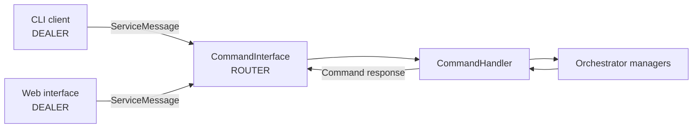

# CommandInterface

`CommandInterface` exposes runtime orchestrator operations to external clients. The orchestrator receives `ServiceMessage` commands through a ZeroMQ ROUTER socket; CLI and web clients connect through DEALER sockets.

## Responsibilities

| Responsibility | Implementation |
|---|---|
| Transport | `MessageChannel("zmq_router", address)` |
| Request handling | `CommandHandler.execute_command_msg()` |
| Permission checks | `CommandPermissions` and `allowed_commands` |
| Response protocol | Structured `ServiceMessage` command responses |
| Error history | Failed interface operations are recorded as `CLI_ERROR` events |
| Lifecycle | Started and stopped with the orchestrator channel handlers |

## Architecture



ROUTER/DEALER is asynchronous and supports multiple clients. It is not the strict REQ/REP pattern.

## Configuration

```python
from PyOrchestrate.core.orchestrator import Orchestrator

config = Orchestrator.Config(
    enable_command_interface=True,
    command_zmq_address="tcp://127.0.0.1:5555",
    allowed_commands="monitoring",
)

orchestrator = Orchestrator(config=config)
```

| Option | Default | Description |
|---|---|---|
| `enable_command_interface` | `True` | Create and start the external command interface |
| `command_zmq_address` | `"tcp://*:5555"` | ROUTER bind address |
| `allowed_commands` | `None` | Preset name, explicit command set, or all commands |

The command interface starts during `Orchestrator` initialization and stops during orchestrator shutdown.

## Commands

The handler recognizes:

| Command | Operation |
|---|---|
| `ps` | List registered agents |
| `status` | Read orchestrator or agent status |
| `dependencies` | Read the dependency mapping |
| `start` | Start a registered agent |
| `stop` | Stop a registered agent |
| `commands` | Inspect effective permissions |
| `stats` | Read resource statistics |
| `history` | Read event history |
| `history-stats` | Read aggregate event statistics |
| `shutdown` | Request graceful shutdown |

<Warning title="Two handlers currently fail">
The agent-specific `status AGENT_NAME` path and `dependencies` handler still read the removed `orchestrator.dependencies` attribute. Orchestrator-level `status` and `ps` are unaffected. See [Runtime Commands](/cli/runtime-commands) for the operational details.
</Warning>

## Permission Presets

`CommandPermissions` provides four presets:

### `production`

Allows operational inspection:

```text
commands
dependencies
history
history-stats
ps
stats
status
```

### `development`

Allows every command.

### `read_only`

Allows the same read-only surface as `production`.

### `monitoring`

Allows:

```text
commands
history
history-stats
ps
stats
status
```

Use a preset:

```python
config = Orchestrator.Config(
    allowed_commands="production",
)
```

Or an explicit set:

```python
config = Orchestrator.Config(
    allowed_commands={"ps", "status", "commands"},
)
```

`None` allows all registered commands. Lists are not accepted.

## Request Protocol

Clients create a command message:

```python
from PyOrchestrate.core.utilities.messaging import ServiceMessage

request = ServiceMessage.create_command(
    sender="my-client",
    command="status",
    args=[],
)
```

The payload contains the command, arguments, request identifier, timestamp, and optional metadata.

Successful responses have a payload shaped like:

```json
{
  "status": "success",
  "code": 0,
  "data": {
    "total_agents": 2
  },
  "error": null,
  "request_id": "...",
  "protocol_version": "..."
}
```

The CLI's JSON formatter prints only the `data` object for successful responses. Direct `MessageChannel` consumers and the web interface receive the complete response payload.

## Client Example

Use the public CLI client wrapper:

```python
from PyOrchestrate.cli import CommandClient

client = CommandClient("tcp://127.0.0.1:5555")
response = client.send_command("status")

if response and response["status"] == "success":
    print(response["data"])
else:
    print(response)
```

## Event History

The command interface records failures as events:

```text
category: cli
event_name: CLI_ERROR
severity: ERROR
```

Successful commands are not currently written as dedicated command-audit events.

Agent lifecycle messages routed by `MessageRouter` also bypass the store in the current implementation, so `history` is not a complete lifecycle audit log.

## Network Security

The default orchestrator address, `tcp://*:5555`, binds every network interface. For local-only clients:

```python
config = Orchestrator.Config(
    command_zmq_address="tcp://127.0.0.1:5555",
)
```

The command transport does not add authentication or encryption. When remote access is necessary:

1. use a trusted private network;
2. restrict the port with firewall rules;
3. configure a restrictive `allowed_commands` preset or set;
4. avoid exposing the ROUTER socket directly to the public internet.

Web authentication protects HTTP access to `pyorchestrate-web`; it does not authenticate direct ZeroMQ clients.

## Error Handling

Rejected or invalid commands return a structured error payload:

```json
{
  "status": "error",
  "code": 403,
  "data": {},
  "error": "Command 'shutdown' is not allowed...",
  "request_id": "...",
  "protocol_version": "..."
}
```

Common failure categories include:

- command not allowed;
- unknown command;
- missing required agent name;
- unknown agent;
- transport timeout or unavailable endpoint.

## Testing

Test the handler without opening a network socket by constructing `CommandHandler` with a mocked orchestrator. Test ROUTER/DEALER integration separately because it requires a local TCP port.

For a running orchestrator:

```bash
pyorchestrate status --socket tcp://127.0.0.1:5555
pyorchestrate commands --socket tcp://127.0.0.1:5555
```

## See Also

- [CLI configuration](/cli/configuration)
- [Runtime commands](/cli/runtime-commands)
- [MessageChannel](/advanced/utilities/message-channel)
