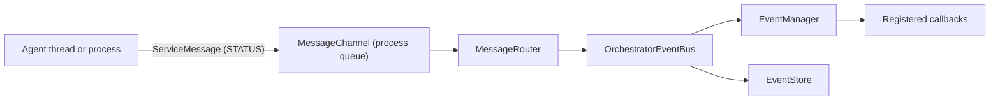

# Orchestrator Internals

`Orchestrator` composes a small set of managers around shared agent metadata. These pages describe the current implementation; most application code should use the public `Orchestrator` methods instead of calling the managers directly.

## Components

| Component | Current responsibility |
|---|---|
| [DependencyGraph](/advanced/orchestrator-internals/dependency-graph) | Validates dependencies and computes a topological **start order** |
| [AgentLifecycleManager](/advanced/orchestrator-internals/lifecycle-manager) | Registers agent entries and starts or stops their thread/process instances |
| [WorkerPoolScheduler](/advanced/orchestrator-internals/worker-pool) | Limits concurrent agents and queues starts above `max_workers` |
| [OrchestratorEventBus](/advanced/orchestrator-internals/event-bus) | Provides callback registration plus an `EventStore` |
| [MessageRouter](/advanced/orchestrator-internals/message-router) | Converts agent `STATUS` messages into orchestrator lifecycle callbacks |
| [CommandInterface](/advanced/orchestrator-internals/command-interface) | Serves runtime CLI/web commands over ZeroMQ |

The managers share an `OMemory` instance whose `agents` attribute is a list of `AgentEntry` objects.

## Startup flow

1. `Orchestrator.start()` asks `DependencyGraph` for a valid start order.
2. `WorkerPoolScheduler` starts up to `max_workers` entries and queues the rest.
3. While reserving a slot, `WorkerPoolScheduler` asks `AgentLifecycleManager` to prepare a numbered startup attempt.
4. Outside the scheduler lock, the lifecycle manager creates and starts that attempt, then waits for its `start_event` with timeout and cancellation protection.
5. The agent later sends generation-tagged `STATUS` messages such as `agent_ready`.
6. `MessageRouter` rejects stale generations and translates supported messages into `OrchestratorEvent` callbacks.

<Warning title="Start order is not readiness">
A dependency is started before its dependent, but the scheduler does not wait for the dependency's `ready_event`. Independent agents also have no guaranteed relative order.
</Warning>

## Message and event flow



The router receives the `OrchestratorEventBus`, so every routed lifecycle event both triggers the registered callbacks and is appended to the event history, alongside the events emitted directly through `orchestrator.event_bus.emit(...)` such as `agent_registered`.

## Control and notification are separate paths

Lifecycle control does not travel through the agent `STATUS` queue. The parent
process calls the worker pool and lifecycle manager directly, while shared
`threading.Event` or `multiprocessing.Event` objects carry acknowledgements and
cooperative stop signals. `ServiceMessage` objects are asynchronous
notifications for the router and registered callbacks.

| Signal | Direction | Transport | Current purpose |
|---|---|---|---|
| `start_event` | Agent to lifecycle manager | Shared event | Acknowledge that `BaseAgent.run()` has started |
| `ready_event` | Agent to application | Shared event | Report that `setup()` completed |
| `close_event` | Agent to parent | Shared event | Report that the agent lifecycle reached its final block |
| `stop_event` | Parent to agent | Shared event | Request cooperative termination |
| `agent_started` | Agent to router | `STATUS` message on the process queue | Emit the started callback |
| `agent_ready` | Agent to router | `STATUS` message on the process queue | Emit the ready callback |
| `agent_close` | Agent to router | `STATUS` message on the process queue | Emit the terminated callback and update router filtering |
| CLI/web command | External client to orchestrator | ZeroMQ `COMMAND` message | Invoke `CommandHandler` operations |

The beginning of an agent run therefore uses two signals:

```python
self._handle_start()                 # queues STATUS / agent_started
self.state_events.start_event.set()  # releases the lifecycle startup wait
```

The process queue is asynchronous. `AgentLifecycleManager` waits for
`start_event`; it does not wait for `MessageRouter` to dispatch the corresponding
callback. The same distinction applies to `agent_ready`/`ready_event` and
`agent_close`/`close_event`.

Stopping also follows the direct control path:

```text
WorkerPoolScheduler.stop_agent()
    -> AgentLifecycleManager.stop_agent()
    -> AgentEntry._stop_instance()
    -> BaseAgent.stop()
    -> stop_event.set()
```

`agent_close` is a notification and does not release worker capacity.
`Orchestrator.join()` releases the slot only after it observes that the current
thread or process is no longer alive.

## Minimal public setup

```python
from PyOrchestrate.core.orchestrator import Orchestrator

orchestrator = Orchestrator(
    config=Orchestrator.Config(
        max_workers=5,
        enable_command_interface=False,
    )
)

orchestrator.register_agent(MyAgent, "worker")
orchestrator.start()
orchestrator.join()
```

The default `max_workers` is `5`. The command interface is enabled by default and binds to `tcp://*:5555`; disable it when runtime CLI/web control is not needed, or bind it explicitly to `tcp://127.0.0.1:5555` for local-only access.

## Dependencies

```python
orchestrator.register_agent(DatabaseAgent, "db")
orchestrator.register_agent(APIAgent, "api")
orchestrator.add_dependency("api", ["db"])

orchestrator.start()
orchestrator.join()
```

This guarantees that the start attempt for `db` occurs before the start attempt for `api`. It does not guarantee that `db` has signalled readiness before `api` starts.

## Runtime inspection

When `enable_command_interface=True`, the CLI and web client communicate with `CommandInterface` through a second `MessageChannel`, using ZeroMQ ROUTER/DEALER sockets. See [Runtime Commands](/cli/runtime-commands) for the supported surface and current limitations.

## Source reference

- `PyOrchestrate/core/orchestrator/orchestrator.py`
- `PyOrchestrate/core/orchestrator/memory.py`
- `PyOrchestrate/core/orchestrator/*_manager.py`
- `PyOrchestrate/core/orchestrator/message_router.py`
- `PyOrchestrate/core/orchestrator/command_interface.py`
