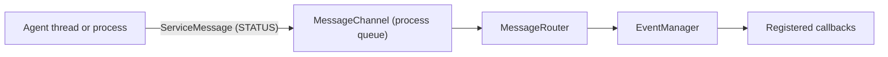

# Orchestrator Internals

`Orchestrator` composes a small set of managers around shared agent metadata. These pages describe the current implementation; most application code should use the public `Orchestrator` methods instead of calling the managers directly.

## Components

| Component | Current responsibility |
|---|---|
| [DependencyGraph](/advanced/orchestrator-internals/dependency-graph) | Validates dependencies and computes a topological **start order** |
| [AgentLifecycleManager](/advanced/orchestrator-internals/lifecycle-manager) | Registers agent entries and starts or stops their thread/process instances |
| [WorkerPoolScheduler](/advanced/orchestrator-internals/worker-pool) | Limits concurrent agents and queues starts above `max_workers` |
| [OrchestratorEventBus](/advanced/orchestrator-internals/event-bus) | Provides callback registration plus an `EventStore` |
| [MessageRouter](/advanced/orchestrator-internals/message-router) | Converts agent `STATUS` messages into orchestrator lifecycle callbacks |
| [CommandInterface](/advanced/orchestrator-internals/command-interface) | Serves runtime CLI/web commands over ZeroMQ |

The managers share an `OMemory` instance whose `agents` attribute is a list of `AgentEntry` objects.

## Startup flow

1. `Orchestrator.start()` asks `DependencyGraph` for a valid start order.
2. `WorkerPoolScheduler` starts up to `max_workers` entries and queues the rest.
3. `AgentLifecycleManager.start_agent()` initializes and starts the thread/process. It waits for `start_event` only when registration supplied an explicit `StateEvents` object.
4. The agent later sends `STATUS` messages such as `agent_ready`.
5. `MessageRouter` translates supported messages into `OrchestratorEvent` callbacks.

<Warning title="Start order is not readiness">
A dependency is started before its dependent, but the scheduler does not wait for the dependency's `ready_event`. Independent agents also have no guaranteed relative order.
</Warning>

## Message and event flow



The router receives the underlying `EventManager`, not the `OrchestratorEventBus`. Consequently, agent lifecycle callbacks run, but those routed lifecycle events are not automatically appended to the event history in the current implementation. Events emitted through `orchestrator.event_bus.emit(...)`, such as `agent_registered`, are recorded.

## Minimal public setup

```python
from PyOrchestrate.core.orchestrator import Orchestrator

orchestrator = Orchestrator(
    config=Orchestrator.Config(
        max_workers=5,
        enable_command_interface=False,
    )
)

orchestrator.register_agent(MyAgent, "worker")
orchestrator.start()
orchestrator.join()
```

The default `max_workers` is `5`. The command interface is enabled by default and binds to `tcp://*:5555`; disable it when runtime CLI/web control is not needed, or bind it explicitly to `tcp://127.0.0.1:5555` for local-only access.

## Dependencies

```python
orchestrator.register_agent(DatabaseAgent, "db")
orchestrator.register_agent(APIAgent, "api")
orchestrator.add_dependency("api", ["db"])

orchestrator.start()
orchestrator.join()
```

This guarantees that the start attempt for `db` occurs before the start attempt for `api`. It does not guarantee that `db` has signalled readiness before `api` starts.

## Runtime inspection

When `enable_command_interface=True`, the CLI and web client communicate with `CommandInterface` through a second `MessageChannel`, using ZeroMQ ROUTER/DEALER sockets. See [Runtime Commands](/cli/runtime-commands) for the supported surface and current limitations.

## Source reference

- `PyOrchestrate/core/orchestrator/orchestrator.py`
- `PyOrchestrate/core/orchestrator/memory.py`
- `PyOrchestrate/core/orchestrator/*_manager.py`
- `PyOrchestrate/core/orchestrator/message_router.py`
- `PyOrchestrate/core/orchestrator/command_interface.py`
