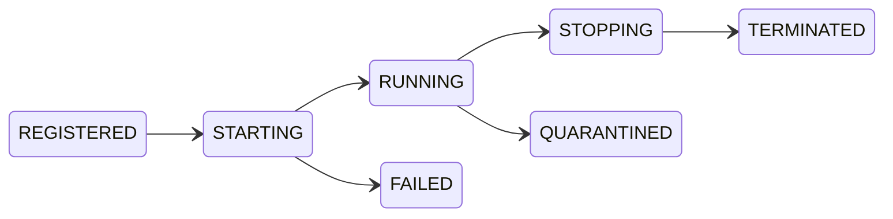
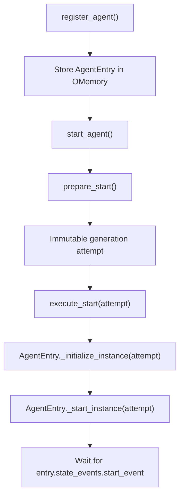

# AgentLifecycleManager

`AgentLifecycleManager` is the internal component that registers agent metadata,
creates agent instances, starts them with timeout protection, and sends stop
requests.

Application code normally uses `Orchestrator.register_agent()`,
`Orchestrator.start()`, and `Orchestrator.stop()`. Direct access to the lifecycle
manager is useful mainly for framework integration and testing.

## Responsibilities

| Responsibility | Current behavior |
|---|---|
| Registration | Stores an `AgentEntry` in `OMemory` and rejects duplicate names |
| Startup preparation | Allocates an immutable generation attempt and enters `STARTING` without blocking |
| Instantiation | Creates an instance only for the currently active attempt |
| Startup execution | Creates and starts the prepared attempt, then waits for its `start_event` |
| Startup outcome | Returns a typed `LifecycleStartResult`, distinguishing clean failure from a still-live failure |
| Timeout handling | Requests stop, joins briefly, force-terminates a process when possible, and quarantines an instance that remains alive |
| Individual stop | Is idempotent and also handles entries that have not been initialized |
| Bulk stop | Attempts every registered entry and reports collected failures afterward |
| Shutdown | Stops, joins within a shared budget, escalates, and reports the agents still alive |
| Lookup | Returns one entry by name or the complete entry list |

Concurrency limiting and queuing belong to
[`WorkerPoolScheduler`](/advanced/orchestrator-internals/worker-pool), not to
`AgentLifecycleManager`.

## Registration

The public entry point is:

```python
entry = orchestrator.register_agent(
    Worker,
    "worker-1",
    custom_config=Worker.Config(limit=5),
    custom_plugin=Worker.Plugin(),
)
```

`name` is required and must be unique.

The lifecycle manager accepts the following values:

| Parameter | Type | Purpose |
|---|---|---|
| `agent_class` | Agent class | Process- or thread-backed agent class |
| `name` | `str` | Unique registered name |
| `custom_config` | `BaseClass.Config \| None` | Configuration passed to the instance |
| `custom_plugin` | `BaseClass.Plugin \| None` | Plugin container passed to the instance |
| `control_events` | `BaseAgent.ControlEvents \| None` | Optional pre-created control events |
| `state_events` | `BaseAgent.StateEvents \| None` | Optional pre-created state events |
| `msg_channel` | `MessageChannel \| None` | Framework message channel |
| `**kwargs` | any | Extra constructor arguments for the agent |

The convention is singular: every agent class exposes `Plugin`, and the
registration parameter is `custom_plugin`.

## AgentEntry

`OMemory.agents` is a list of `AgentEntry` objects. Use the memory lookup method
instead of indexing the list by name:

```python
entry = orchestrator.memory.get_agent("worker-1")
if entry is None:
    raise LookupError("worker-1 is not registered")
```

An entry stores:

- `agent_class` and `name`;
- optional `config` and `plugin` objects;
- optional `control_events` and `state_events`;
- extra constructor keyword arguments;
- the current agent `instance`, after initialization;
- its parent-process `AgentLifecycleState`;
- the monotonically increasing `generation_id`;
- the active startup attempt and the generation owning the current instance.

The tracked states are:



A terminated or failed entry can create a fresh generation. Starting an entry
that is already starting, running, or stopping raises `RuntimeError`; the live
instance is never overwritten.

The instance is intentionally created at start time rather than registration
time:



Accessing `entry.instance` before initialization raises an assertion error.

## Startup and Timeout

The orchestrator starts entries through its worker pool:

```python
result = orchestrator.worker_pool.start_agent("worker-1")
```

Inspect `result.status`: scheduler results distinguish `STARTED`, `QUEUED`,
`CANCELLED`, `FAILED_CLEAN`, and `FAILED_LIVE`.

`AgentLifecycleManager.start_agent()` waits for `start_event`, which is set near
the beginning of `BaseAgent.run()`. This applies both to explicitly supplied
events and to the default events created by the concrete instance:
the private instance initializer synchronizes the entry with those event
containers before startup.

The worker pool uses the split internal path: `prepare_start()` runs while the
slot reservation is protected by the scheduler lock, and `execute_start()` runs
after that lock is released. A stop arriving after reservation therefore
cancels the exact prepared generation instead of being lost before `STARTING`.

Consequently, a successful return never means that `setup()` has completed.

Wait explicitly when readiness matters:

```python
entry = orchestrator.memory.get_agent("worker-1")
if entry is not None:
    entry.instance.state_events.ready_event.wait(timeout=10)
```

Agent configuration validation happens inside `BaseAgent.run()`, after the
process or thread has started and before `setup()` and `execute()`.

## State and Control Events

The current event containers expose:

| Event | Direction | Purpose |
|---|---|---|
| `state_events.start_event` | Agent to lifecycle manager | Acknowledge entry into `BaseAgent.run()` |
| `state_events.ready_event` | Agent to application | Report that `setup()` completed |
| `state_events.close_event` | Agent to parent | Report that the final lifecycle block completed |
| `control_events.setup_event` | Parent to agent | Allow `setup()` to proceed |
| `control_events.execute_event` | Parent to agent | Allow `execute()` to proceed |
| `control_events.stop_event` | Parent to agent | Request cooperative termination |

These shared events control and synchronize the lifecycle. Generation-tagged
`ServiceMessage` values such as `agent_started`, `agent_ready`, and
`agent_close` are separate asynchronous notifications consumed by
`MessageRouter`.

There are no built-in `pause`, `resume`, `error`, `terminated`, or force-shutdown
event fields.

## Stopping Agents

Request an individual stop:

```python
orchestrator.worker_pool.stop_agent("worker-1")
```

Request a stop for every registered agent:

```python
orchestrator.stop()
```

These application-level paths preserve the worker queue before delegating to
the lifecycle manager. Framework integrations can call
`lifecycle_manager.stop_agent()` directly only when scheduler accounting is
handled separately.

For a running entry the lifecycle manager sends the cooperative stop request
through the lifecycle-owned instance operation. Stop ownership is claimed once
per generation, so startup cleanup can still join or escalate without invoking
`BaseAgent.stop()` and application `on_stop()` a second time. Calling stop again
is harmless. Stopping a registered but not yet initialized entry transitions it
directly to `TERMINATED`.

Normal stop requests do not join or force-terminate an agent; use
`Orchestrator.join()` for the normal orchestrator lifecycle, whose shutdown
path is described below. Startup-timeout
cleanup is stricter: it requests stop, performs a bounded join, and can
force-terminate a process that remains alive. A thread cannot be forcefully
terminated. If one remains alive, the result is `FAILED_LIVE`, the entry becomes
`QUARANTINED`, and the worker pool retains its occupied slot.

Startup waits in short intervals and checks a cancellation signal. A concurrent
stop can therefore cancel an entry in `STARTING` without waiting for the full
`agent_start_timeout`.

`WorkerPoolScheduler.stop_agent()` removes a queued start before delegating to
the lifecycle manager. `Orchestrator.stop()` similarly clears the scheduler
queue before requesting a stop for every registered entry.

## Orchestrator Shutdown

`stop_all()` requests termination and returns. `shutdown_all()` is its blocking
counterpart, used by `Orchestrator.join()` once its loop exits, because agents
must be gone before the message router and the plugins are torn down:

```python
survivors = orchestrator.worker_pool.shutdown_all(timeout=10.0)
```

<Steps>
  <Step title="Request the stop">
    `stop_all()` runs first. A failed stop request does not abort the shutdown;
    the entry is still joined and escalated below.
  </Step>
  <Step title="Join within the budget">
    `timeout` is a single budget shared by every agent, not a per-agent one.
    `None` waits indefinitely.
  </Step>
  <Step title="Escalate on survivors">
    A process agent that is still alive is force-terminated. A thread agent
    cannot be, so it is quarantined and logged as `CRITICAL`.
  </Step>
  <Step title="Record the outcome">
    Entries that terminated become `TERMINATED`; the returned list names the
    agents that are still alive.
  </Step>
</Steps>

The budget comes from `Orchestrator.Config.agent_stop_timeout`, which defaults
to `10.0` seconds.

<Warning>
  `BaseAgent.stop()` invokes application `on_stop()` in the *caller's* thread —
  on this path the orchestrator's, not the agent's own. For a process agent that
  is a different *process*, so the hook runs against a copy and anything it
  changes on `self` is invisible to the agent that is actually running. Put
  cleanup that must run inside the agent in `on_close()`, or have the agent react
  to `control_events.stop_event`.
</Warning>

### The Whole Teardown

`shutdown_all()` only covers the agents. `Orchestrator.shutdown()` is the
complete teardown, and the same one `join()` performs when its loop exits:

<Steps>
  <Step title="Stop and join every agent">
    Through `worker_pool.shutdown_all()`, exactly as above.
  </Step>
  <Step title="Record the SHUTDOWN event">
    With the agent total and the number of survivors.
  </Step>
  <Step title="Stop the channel handlers">
    The message router first, then the command interface.
  </Step>
  <Step title="Finalize the plugins">
    Through the orchestrator's `PluginManager`.
  </Step>
  <Step title="Release the orchestrator's own resources">
    The event bus is shut down and the agent message channel closed. Skipping
    this left a `ThreadPoolExecutor` thread and a queue feeder thread alive for
    every orchestrator ever built.
  </Step>
</Steps>

Calling it twice is a no-op, so a driver that also runs `join()` cannot tear the
same orchestrator down twice.

An orchestrator that nothing drives with `join()` has one more obligation:
reclaiming the worker slots of agents that have finished, which is what starts
whatever is waiting in the queue. `join()` does it on every tick; anything else
has to call it:

```python
orchestrator.reap_terminated_agents()
```

This is how `PoolAgent` supervises its inner orchestrator from `runner()`.

## Dynamic Starts

When starting a newly registered agent while an orchestrator is already
running, go through `WorkerPoolScheduler`:

```python
orchestrator.register_agent(Worker, "worker-2")
orchestrator.worker_pool.start_agent("worker-2")
```

Calling `lifecycle_manager.start_agent()` directly bypasses the worker count,
queue, and `_started_agents` tracking used by `Orchestrator.join()` and the CLI.

Before every fresh start, the lifecycle manager activates the entry's new
`generation_id` in `MessageRouter`. Late messages from older instances with the
same name are rejected.

`AgentEntry` does not expose public start, stop, join, initialize, or restart
operations. `restart_agent()` goes through the same timeout, hook, transition,
and attempt logic as the first start. A dead previous instance is detached when
the new attempt is prepared, so a constructor failure cannot clean up the old
generation. Application-level restarts should still enter through
`WorkerPoolScheduler` so capacity remains coherent.

## Plugin Lifecycle

`AgentLifecycleManager` passes the selected plugin container to the agent.
`BaseAgent.run()` owns the actual plugin lifecycle:

1. set the plugin owner;
2. initialize plugins;
3. run `setup()` and `execute()`;
4. call `on_close()`;
5. finalize plugins.

## Current Public Methods

```text
register_agent(...)
prepare_start(agent_name) -> AgentStartAttempt
execute_start(agent_name, attempt) -> LifecycleStartResult
start_agent(agent_name) -> LifecycleStartResult
restart_agent(agent_name) -> LifecycleStartResult
stop_agent(agent_name) -> None
stop_all() -> None
shutdown_all(timeout=None) -> list[str]
join_agent(agent_name, timeout=None) -> None
is_attempt_alive(agent_name, attempt) -> bool
mark_terminated(agent_name) -> None
get_agent(agent_name) -> AgentEntry
get_all_agents() -> list[AgentEntry]
```

`start_agent()` also returns `LifecycleStartResult`, whose status is one of
`STARTED`, `CANCELLED`, `FAILED_CLEAN`, or `FAILED_LIVE`.

For exact signatures, see the
[generated API reference](/api/orchestrator).

## See Also

- [WorkerPoolScheduler](/advanced/orchestrator-internals/worker-pool)
- [DependencyGraph](/advanced/orchestrator-internals/dependency-graph)
- [MessageRouter](/advanced/orchestrator-internals/message-router)
- [Agent lifecycle](/learn/agents/built-in-agents/baseagent)
