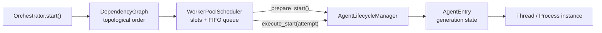
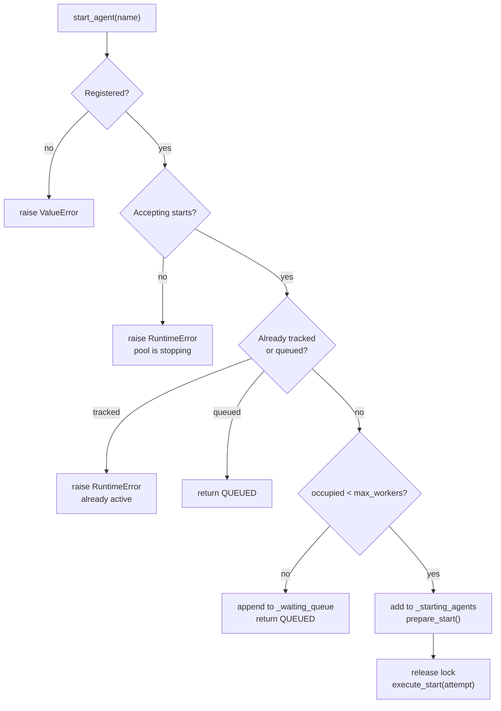
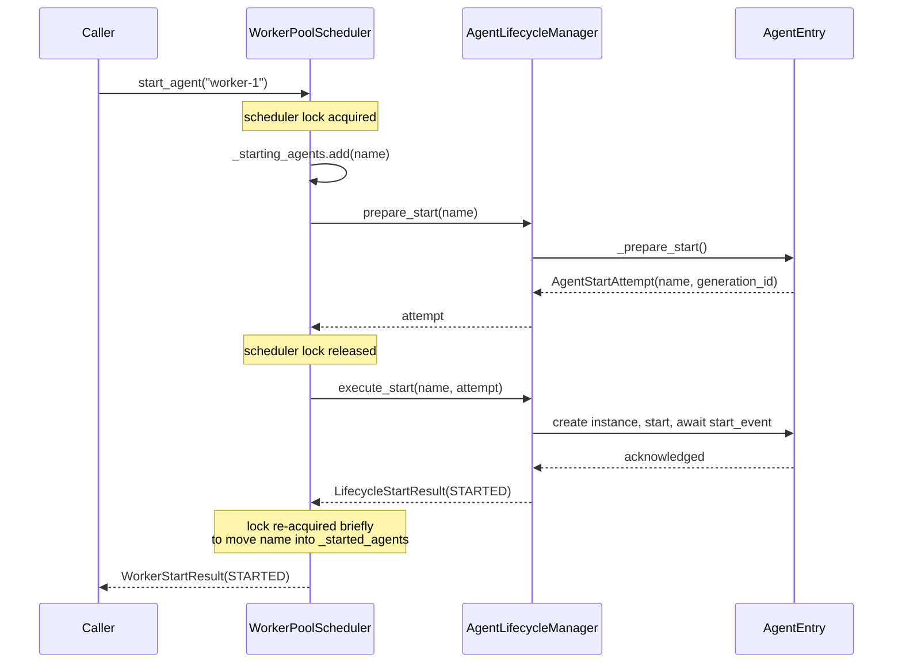
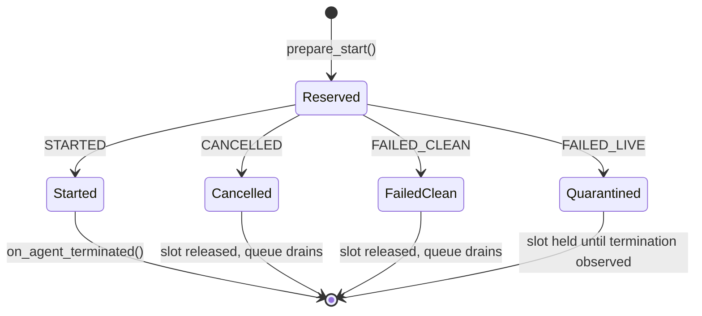
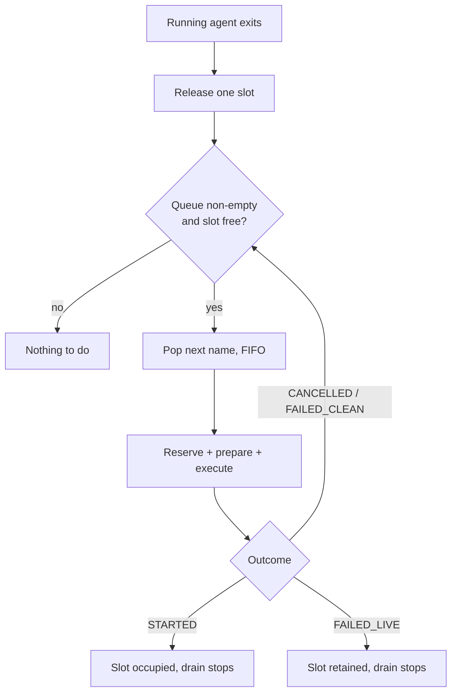

# WorkerPoolScheduler

`WorkerPoolScheduler` limits how many registered agents occupy a worker slot at
the same time. It starts an agent immediately when a slot is free and places the
agent name in a FIFO queue when the pool is full.

<Info>
  The default `Orchestrator.Config.max_workers` value is `5`. Each successful
  start occupies exactly one slot, whether the agent is process-backed or
  thread-backed.
</Info>

## Where it sits

The scheduler owns *capacity accounting* only. It never creates or terminates an
instance itself: every concrete lifecycle transition is delegated to
`AgentLifecycleManager`, which in turn acts on the `AgentEntry`.



## Responsibilities

| Responsibility | Current behavior |
|---|---|
| Capacity check | Counts starting, running, and quarantined live-failure reservations |
| Immediate start | Reserves capacity and prepares a generation attempt under the scheduler lock |
| Blocking startup | Executes the prepared attempt after releasing the scheduler lock |
| Queueing | Appends an agent name to a `deque` |
| Termination | Frees one slot and starts the next queued agent that can start successfully |
| Stop | Cancels a queued start or delegates a running-agent stop |
| Completion | Reports finished when no agents are starting, running, quarantined, or queued |

The scheduler does not maintain a completed-agent collection and does not
implement priority classes.

## Slot accounting

A slot is not "one running agent". Occupancy is the union of three disjoint
sets, so an agent that is still booting already holds capacity:

```python
def _occupied_count_unlocked(self) -> int:
    return (
        len(self._starting_agents)
        + len(self._started_agents)
        + len(self._failed_live_agents)
    )
```

| Set | Meaning | Releases the slot when |
|---|---|---|
| `_starting_agents` | Reserved, attempt prepared, startup in flight | The attempt resolves, either way |
| `_started_agents` | Startup acknowledged, agent running | `on_agent_terminated()` observes the exit |
| `_failed_live_agents` | Startup failed but the instance survived cleanup | Termination is eventually observed |

<Warning>
  Quarantined live failures keep occupying capacity by design. Losing a slot is
  preferable to ignoring a process that may still be alive and holding
  resources.
</Warning>

## Start or queue

```python
result = orchestrator.worker_pool.start_agent("worker-1")
```

The decision is taken entirely under the scheduler lock, so two concurrent
callers can never claim the same last slot:



`result.status` is one of `STARTED`, `QUEUED`, `CANCELLED`, `FAILED_CLEAN`, or
`FAILED_LIVE`. A live failure is never folded into an ordinary failure.

<Tip>
  Use the `result.started` and `result.queued` helper properties instead of
  comparing the enum by hand — they keep call sites readable without hiding the
  three distinct failure statuses.
</Tip>

## Two-phase startup

This is the core of the scheduler's concurrency design. Reserving a slot is
fast and happens under the lock; actually booting an agent is slow and happens
outside it.



Holding the lock across `execute_start()` would freeze the whole pool for the
duration of a boot — up to `agent_start_timeout`. Splitting the call keeps the
lock uncontended while still closing the reservation window: the name enters
`_starting_agents` and the entry enters `STARTING` atomically, so a concurrent
stop can never slip in between.

The returned `AgentStartAttempt` carries the `generation_id`, which is what makes
a concurrent stop refer to the same generation that owns the slot instead of an
older or newer incarnation of the same agent name.

<Note>
  See [AgentLifecycleManager](/advanced/orchestrator-internals/lifecycle-manager)
  for what happens when a stop request arrives while an attempt is still in
  `STARTING`.
</Note>

## Outcome of a reservation

Every reservation ends in exactly one of four states, and only one of them keeps
the slot:



## Termination flow

`Orchestrator.join()` detects that a started agent is no longer alive and calls:

```python
orchestrator.worker_pool.on_agent_terminated("worker-1")
```

<Steps>
  <Step title="Release the reservation">
    The name is discarded from all three occupancy sets under the lock.
  </Step>
  <Step title="Mark the lifecycle as terminated">
    `lifecycle_manager.mark_terminated()` records the observed exit.
  </Step>
  <Step title="Drain the waiting queue">
    Names are popped from the left of `_waiting_queue` in FIFO order.
  </Step>
  <Step title="Prepare under the lock">
    Each selected entry reserves its slot and prepares an attempt while the lock
    is held.
  </Step>
  <Step title="Execute until one sticks">
    Attempts run outside the lock; the drain continues past clean failures and
    stops on `STARTED` or `FAILED_LIVE`.
  </Step>
</Steps>



<Warning>
  The `agent_close` `STATUS` message sent from the final block of
  `BaseAgent.run()` does **not** release the worker slot. `MessageRouter` uses it
  for termination callbacks and stale-message filtering only. Capacity is
  released solely when `Orchestrator.join()` observes `is_alive() == False` and
  calls `on_agent_terminated()`.
</Warning>

## Stopping

`stop_agent()` removes the name from the waiting queue under the lock, then
delegates to the lifecycle manager outside it:

```python
def stop_agent(self, agent_name: str) -> None:
    with self._lock:
        was_queued = agent_name in self._waiting_queue
        if was_queued:
            self._waiting_queue = deque(
                name for name in self._waiting_queue if name != agent_name
            )
    self.lifecycle_manager.stop_agent(agent_name)
```

An agent that was still queued therefore never starts at all. `stop_all()`
additionally sets `_accepting_starts = False`, which is a one-way switch: after
it, `start_agent()` raises `RuntimeError` for the remaining life of the
scheduler.

## Shutting down

`stop_all()` only *requests* termination and returns immediately. When the
orchestrator itself is going down, `Orchestrator.join()` calls the blocking
counterpart instead:

```python
survivors = orchestrator.worker_pool.shutdown_all(timeout=10.0)
```

It clears the queue, delegates to
[`AgentLifecycleManager.shutdown_all()`](/advanced/orchestrator-internals/lifecycle-manager),
and then releases the slot of every agent that terminated. The return value
lists the agents that are still alive; each of those retains its slot and is
quarantined.

## Monitoring

```python
pool = orchestrator.worker_pool

print(pool.running_count)   # started + quarantined
print(pool.queue_size)
print(pool.all_finished)
print(pool.get_stats())
```

`get_stats()` returns:

```python
{
    "running": 2,
    "starting": 1,
    "queued": 3,
    "quarantined": 0,
    "max_workers": 5,
    "capacity_used": "3/5",
    "started_agents": ["worker-1", "worker-2"],
    "starting_agents": ["worker-3"],
    "quarantined_agents": [],
}
```

Agent-name lists are returned in sorted order.

<Tip>
  `capacity_used` counts starting agents too, so it can exceed `running`. In the
  snippet above two agents are running and one is still booting, hence `3/5`.
</Tip>

## Configure capacity

```python
from PyOrchestrate.core.orchestrator import Orchestrator

config = Orchestrator.Config(max_workers=3)
orchestrator = Orchestrator(config=config)
```

Choose capacity based on the actual resource profile of the agents. The
scheduler treats process-backed and thread-backed agents equally: each
successful start occupies one slot.

## Dependencies and scheduling

During `Orchestrator.start()`:

1. `DependencyGraph` validates the graph;
2. it returns a topological order;
3. each name is submitted to `WorkerPoolScheduler` in that order.

This preserves dependency order in the submission sequence, but does not
implement readiness barriers. When multiple slots are free, a dependency and its
dependent can both be started during the same `Orchestrator.start()` call.

See [DependencyGraph](/advanced/orchestrator-internals/dependency-graph) for the
exact distinction between startup ordering and readiness.

## Dynamic starts

```python
orchestrator.register_agent(Worker, "worker-2")
orchestrator.worker_pool.start_agent("worker-2")
```

<Warning>
  Calling `lifecycle_manager.start_agent()` directly bypasses scheduler counters
  and queue tracking. The agent will run, but it occupies no slot and is
  invisible to `get_stats()` and `all_finished`.
</Warning>

## Current limitations

<AccordionGroup>
  <Accordion title="No readiness barrier">
    A running slot is counted after the prepared
    `AgentLifecycleManager.execute_start()` attempt returns `STARTED`; a
    reservation is already held during `STARTING`. This occurs after
    `start_event`, for both supplied and default event containers. It still does
    not wait for setup or readiness.
  </Accordion>

  <Accordion title="Synchronization scope">
    Scheduler mutations are protected by an internal re-entrant lock. Blocking
    startup, acknowledgement waits, stop requests, and cleanup happen outside
    that lock, so one slow agent does not block pool statistics or operations on
    an independent agent. Only the non-blocking attempt preparation occurs while
    the lock is held, closing the reservation-to-`STARTING` cancellation window.
  </Accordion>

  <Accordion title="Quarantined live failures">
    If startup cleanup cannot terminate an instance, its name remains in
    `quarantined_agents` and continues to occupy capacity. The queue does not
    advance through that slot until termination is observed. Clean startup
    failures release their reservation and the FIFO drain continues.
  </Accordion>

  <Accordion title="Runtime capacity changes">
    Changing `max_workers` affects future capacity checks. It does not
    automatically drain the queue or stop already running agents.
  </Accordion>
</AccordionGroup>

## See also

<CardGroup cols={2}>
  <Card title="AgentLifecycleManager" href="/advanced/orchestrator-internals/lifecycle-manager">
    Generations, startup attempts, and cancellation semantics.
  </Card>
  <Card title="DependencyGraph" href="/advanced/orchestrator-internals/dependency-graph">
    Startup ordering versus readiness.
  </Card>
  <Card title="Orchestrator" href="/learn/orchestrator/built-in-orchestrator/baseorchestrator">
    Configuration and the public start/join API.
  </Card>
  <Card title="Generated API reference" href="/api/orchestrator">
    Signatures and parameters straight from the docstrings.
  </Card>
</CardGroup>
