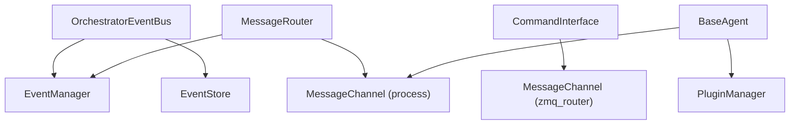

# Core Utilities

These low-level components support the orchestrator, agents, CLI and plugins. Most application code should use the higher-level APIs documented under [Orchestrator Internals](/advanced/orchestrator-internals/index).

| Utility | Role |
|---|---|
| [EventManager](/advanced/utilities/event-manager) | Asynchronous enum-to-callback dispatch |
| [PluginManager](/advanced/utilities/plugin-manager) | Plugin discovery, owner injection, initialization and finalization |
| [MessageChannel](/advanced/utilities/message-channel) | Queue or ZeroMQ transport for `ServiceMessage` envelopes |

## How they are composed



`MessageRouter` receives the `EventManager` directly, so its lifecycle callbacks do not currently pass through the event-store recording path.

## Application-facing examples

```python
from PyOrchestrate.core.orchestrator import Orchestrator
from PyOrchestrate.core.utilities.event import OrchestratorEvent

orchestrator = Orchestrator()
orchestrator.register_event(
    OrchestratorEvent.AGENT_READY,
    lambda agent_name: print(f"{agent_name} is ready"),
)
```

Agent instances expose `plugin_manager` and `msg_channel`. The attribute is named `msg_channel`, not `message_channel`.

Use direct utility access primarily when extending or testing the framework:

```python
orchestrator.event_bus
orchestrator.lifecycle_manager
orchestrator.message_router
orchestrator.command_interface
```

## Import paths

```python
from PyOrchestrate.core.agent.base_agent import BaseAgent
from PyOrchestrate.core.utilities.event_manager import EventManager
from PyOrchestrate.core.utilities.messaging import MessageChannel, ServiceMessage
from PyOrchestrate.core.plugins.plugin_manager import PluginManager
```

Note the singular package path `core.agent`.
