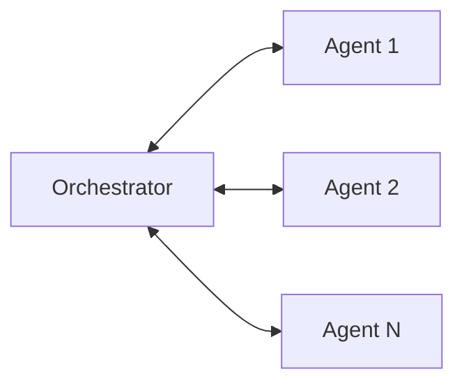
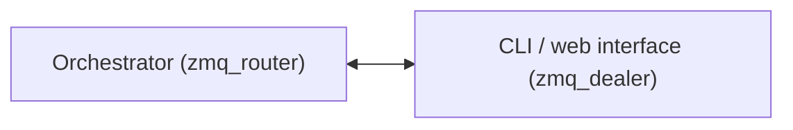

# Message Channel

This page documents the internal Message Channel used by the framework. It is intended for maintainers and integrators who need to understand the message formats and the role of the channel within the system. The module is consumed by framework components such as the orchestrator, agents, CLI and webclient — it is not a user-facing API.

## Purpose

The Message Channel is a transport-agnostic primitive that carries logical envelopes between framework components. It standardizes message shapes, framing, correlation and basic validation so higher-level components can focus on application logic.

## The two channels

A running system contains two distinct `MessageChannel` instances, chosen through the `a_type` argument. They carry the same envelopes over different transports and serve different pairs of components.

### 1. Queue-based — orchestrator ↔ agents

Built with `a_type="thread"` or `a_type="process"` depending on how the agents run. The channel is local to the machine and backed by a standard queue.



In practice only `STATUS` messages travel this way, from the agents to the orchestrator. The orchestrator consumes them and re-emits the corresponding events through the `EventManager`:

- `AGENT_STARTED` — the agent has started.
- `AGENT_READY` — the agent is ready.
- `AGENT_TERMINATED` — the agent has closed.
- `AGENT_ERROR` — the agent reported an error (payload starts with `ERROR:`).

<Warning>
The orchestrator → agent direction of this channel is not consumed by anything today. Agents are driven through their [ControlEvents](/learn/agents/index#controlevents), not by messages on the queue.
</Warning>

### 2. ZeroMQ-based — orchestrator ↔ CLI and web interface

Built with `a_type="zmq_router"` on the orchestrator side and `a_type="zmq_dealer"` on the client side, over a TCP address (`tcp://127.0.0.1:5555` by default). This is what lets an external process attach to a running orchestrator.



Here the traffic is `COMMAND`: the client sends a request, the orchestrator parses the payload, delegates execution to a `CommandHandler` and sends the response — or the error — back over the same channel, correlated by `request_id`.

## Supported message types

Two logical message types are supported: COMMAND and STATUS. Both are serialized as JSON envelopes with a small set of top-level fields.

### Envelope fields (top level)

| Field | Type | Description |
|---|---|---|
| `sender` | string | Origin identifier (agent id, orchestrator, etc.) |
| `event_name` | string | Logical message type: `"COMMAND"` or `"STATUS"` |
| `payload` | object | Message-specific content (always a JSON object) |
| `timestamp` | string | ISO8601 timestamp for envelope creation |

<Tip>
When sending envelopes over stream transports, prefer line-delimited JSON (one JSON object per line) to simplify framing.
</Tip>

### COMMAND — request

Primary payload fields:

- `command` (string): command name
- `args` (array): command arguments (structured)
- `request_id` (string): unique id to correlate request and response
- `meta` (object, optional): free-form metadata

Example request envelope:

```json
{
	"sender": "agentX",
	"event_name": "COMMAND",
	"payload": {
		"command": "do_work",
		"args": [],
		"request_id": "550e8400-e29b-41d4-a716-446655440000",
		"meta": {}
	},
	"timestamp": "2025-10-05T12:34:56.789"
}
```

### COMMAND — response

Primary payload fields:

- `status` ("success" | "error"): outcome
- `code` (int): numeric status or error code
- `data` (object): response data when successful
- `error` (string): human-readable error message when applicable
- `request_id` (string): original request id for correlation
- `protocol_version` (string): protocol version used by the framework

Example response envelope:

```json
{
	"sender": "orchestrator",
	"event_name": "COMMAND",
	"payload": {
		"status": "success",
		"code": 0,
		"data": {},
		"error": "",
		"request_id": "550e8400-e29b-41d4-a716-446655440000",
		"protocol_version": "1.0"
	},
	"timestamp": "2025-10-05T12:34:57.123"
}
```

### STATUS

Primary payload fields:

- `status` (string): short state (e.g. "running", "idle")
- `event` (string): descriptive event name (e.g. "heartbeat")
- `error` (string, optional): error message when applicable

Example status envelope:

```json
{
	"sender": "agentX",
	"event_name": "STATUS",
	"payload": {
		"status": "running",
		"event": "heartbeat",
		"error": ""
	},
	"timestamp": "2025-10-05T12:35:00.000"
}
```

## High-level behaviour (internals)

- Transport-agnostic: the channel exposes a small, consistent surface so the rest of the framework does not need to know transport details (in-process queues, IPC, ZMQ).
- Framing and serialization: messages are serialized to JSON and framed (line-delimited or transport-framed) by the channel implementation.
- Validation and correlation: basic envelope validation is performed on receive; `request_id` is used to correlate COMMAND request/response flows.
- Operational safeguards: the channel enforces timeouts, message size limits and clean shutdown semantics to protect the runtime.

The module is internal: application code interacts with higher-level framework APIs rather than the channel directly. If you need agents to exchange data of your own, use the [Communication Plugins](/learn/agents/plugins/communication-plugins) instead — they exist precisely so that user traffic does not share the framework's control channel.

## Operational notes

- Use line-delimited JSON when sending envelopes over stream transports (one JSON object per line).
- Avoid embedding unescaped newlines inside the top-level JSON envelope.
- Always include `request_id` for COMMAND requests that expect a response.
- Respect `protocol_version` when interpreting COMMAND responses for compatibility.
- Ensure clean shutdown of transport endpoints to avoid stale socket files or resources.

## See also

- [`MessageChannel` and `ServiceMessage` in the API reference](/api/utilities) — constructor arguments, methods and exact signatures, generated from the source.
- [Communication Plugins](/learn/agents/plugins/communication-plugins) — the user-facing way to make agents talk to each other and to the outside world.
