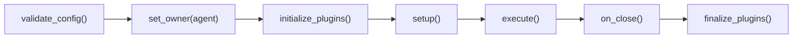

# Plugin Manager

`PluginManager` discovers plugin objects from an agent or orchestrator `Plugin` container, assigns their owner, and calls their lifecycle methods.

## Construction

```python
from PyOrchestrate.core.plugins.plugin_manager import PluginManager

manager = PluginManager(plugin_container)
manager.set_owner(owner)
```

The constructor stores the container but does not immediately extract plugins. Discovery is lazy and occurs when `set_owner()`, `plugin_info()`, `initialize_plugins()` or `get_plugin()` first needs the cached list.

## Discovery rules

The current implementation builds a set of public attribute names from:

- the concrete plugin container class;
- the container instance;
- `_custom_attr`, when present.

It resolves every name with `getattr()`, so the container's own attribute-resolution rules determine precedence. Values are ignored when they are `None`, a function, method or class. Other public values are treated as plugin instances and are expected to implement the plugin protocol.

<Note>
Discovery order is derived from a Python `set`; do not rely on plugin initialization or finalization order.
</Note>

## Lifecycle methods

| Method | Behaviour |
|---|---|
| `set_owner(owner)` | Caches the owner, discovers plugins if needed, then calls `plugin.set_owner(owner)` |
| `plugin_info()` | Logs discovered plugin names and types when an owner exists |
| `initialize_plugins()` | Calls `initialize()` on every discovered plugin |
| `finalize_plugins()` | Calls `finalize()` when discovery has already occurred |
| `get_plugin(name)` | Returns the named plugin or `None` |

Exceptions from an individual plugin are logged and the manager continues with the remaining plugins. This error isolation also means initialization failure is not automatically re-raised to the owning agent or orchestrator.

## Framework-managed lifecycle

`Orchestrator` creates its plugin manager during construction, sets the owner and initializes plugins immediately. It finalizes them near the end of `join()`.

`BaseAgent` creates a plugin manager during agent construction, but sets the owner and initializes plugins inside `run()`, after configuration validation. Finalization occurs in `run()`'s `finally` block after `on_close()`.



Plugin lifecycle is owned by `BaseAgent` and `Orchestrator`; `AgentLifecycleManager` does not initialize or finalize agent plugins itself.

## Retrieval

Agent and orchestrator code can retrieve a plugin by its public container attribute name:

```python
heartbeat = orchestrator.plugin_manager.get_plugin("heartbeat")
transport = agent.plugin_manager.get_plugin("transport")
```

For user-facing plugin definition patterns, see [Communication Plugins](/learn/agents/plugins/communication-plugins).

## Source reference

- `PyOrchestrate/core/plugins/plugin_manager.py`
- `PyOrchestrate/core/agent/base_agent.py`
- `PyOrchestrate/core/orchestrator/orchestrator.py`
