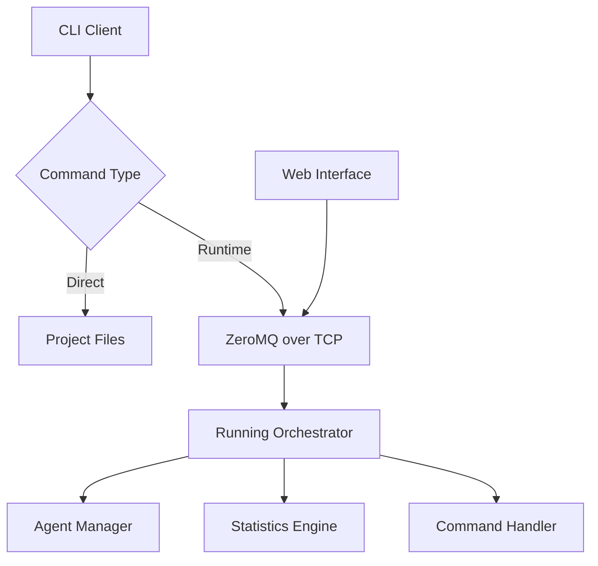

# PyOrchestrate CLI

The PyOrchestrate Command Line Interface (CLI) provides powerful tools for managing and interacting with your orchestrator and agents both during development and at runtime.

The CLI offers two main categories of functionality:

## Project Management Commands

Basic commands for project initialization and setup:

- **Project creation**: `create` - Bootstrap new PyOrchestrate projects with proper structure
- **Version information**: `--version` - Display CLI version information

## Runtime Commands

Advanced commands for real-time control of running orchestrators:

- **Agent monitoring**: `ps` - View status and statistics of running agents
- **Dynamic control**: `start`/`stop` - Start, stop, and manage agents on-demand
- **System inspection**: `status` - Get an orchestrator report, or the report of a single agent with `status AGENT_NAME`
- **Dependencies**: `dependencies` - Show the dependency graph
- **Command permissions**: `commands` - Show which runtime commands are allowed
- **Event tracking**: `history`/`history-stats` - Get event history and statistics
- **Real-time monitoring**: `stats` - Continuous monitoring like `docker stats`
- **Remote management**: `shutdown` - Gracefully shutdown the orchestrator through ZeroMQ

## Web Interface

PyOrchestrate also provides a web-based interface for monitoring your orchestrator:

- **Web dashboard**: `pyorchestrate-web` - Launch a browser-based monitoring interface
- **Runtime data**: Inspect agent lists, orchestrator status, statistics, and stored event history
- **Authentication**: Optional token-based authentication for secure access
- **Remote access**: Read orchestrator data from a browser or REST client

### Output Formats

Runtime commands support two output formats, except `stats`, which uses a continuously refreshed table:

- **Table format** (`--format table`): Human-readable output with formatted tables (default)
- **JSON format** (`--format json`): Machine-readable output for automation

<Tip title="Real-time Control">
The runtime commands enable DevOps workflows, monitoring integration, and dynamic agent management without stopping your orchestrator.
</Tip>

## Installation

The CLI is automatically installed when you install PyOrchestrate:

```bash
pip install .
```

Verify the installation:

```bash
pyorchestrate --help
```

## Getting Started

### Basic Usage

```bash
# Initialize a new project
pyorchestrate create my-project

# Show CLI help
pyorchestrate --help

# Show WebServer help
pyorchestrate-web --help

# Start web interface
pyorchestrate-web --host 0.0.0.0 --port 8000 --socket tcp://127.0.0.1:5555
```

### Runtime Control

To use runtime commands, the orchestrator command interface must be enabled. It is enabled by default, but configuring it explicitly makes the runtime endpoint clear:

```python
from PyOrchestrate.core.orchestrator import Orchestrator

config = Orchestrator.Config(
    enable_command_interface=True,
    command_zmq_address="tcp://127.0.0.1:5555",
)

orchestrator = Orchestrator(config=config)
```

Then you can control the running orchestrator:

```bash
# List all agents and their status
pyorchestrate ps

# Get orchestrator statistics (real-time monitoring)
pyorchestrate stats

# Start a specific agent
pyorchestrate start MyAgent

# Get event history
pyorchestrate history --last 10

# Shutdown orchestrator
pyorchestrate shutdown

# Start web interface for visual monitoring
pyorchestrate-web --port 8000 --socket tcp://127.0.0.1:5555
```

## Architecture

The CLI consists of two main components:

### 1. Direct Commands
Commands that operate on project files and configurations without requiring a running orchestrator.

### 2. ZeroMQ-based Commands
Commands that communicate with a running orchestrator through a ZeroMQ ROUTER/DEALER channel over TCP, enabling real-time control and monitoring.



## Security Considerations

- **Network binding**: `command_zmq_address` defaults to `tcp://127.0.0.1:5555`, reachable from this machine only
- **Remote exposure**: Binding to `tcp://*:5555` exposes the command interface on every network interface. Nothing on the interface authenticates the client, so whoever reaches the port can run every allowed command; the orchestrator logs a warning at startup when it binds such an address
- **Command Validation**: All commands are validated before execution
- **Command Restrictions**: Use `allowed_commands` to select a preset or provide an explicit set of permitted commands

## Next Steps

- Learn about [Runtime Commands](/cli/runtime-commands) for real-time orchestrator control
- Explore [Web Interface](/cli/web-interface) for browser-based monitoring
- Check [Configuration](/cli/configuration) options for the command interface
- See practical [Examples](/cli/examples) of CLI usage in different scenarios

The PyOrchestrate CLI bridges the gap between development and operations, providing both developer-friendly tools and production-ready management capabilities.
