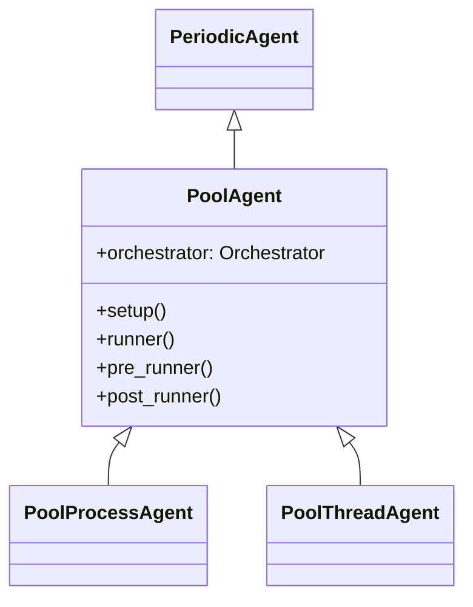
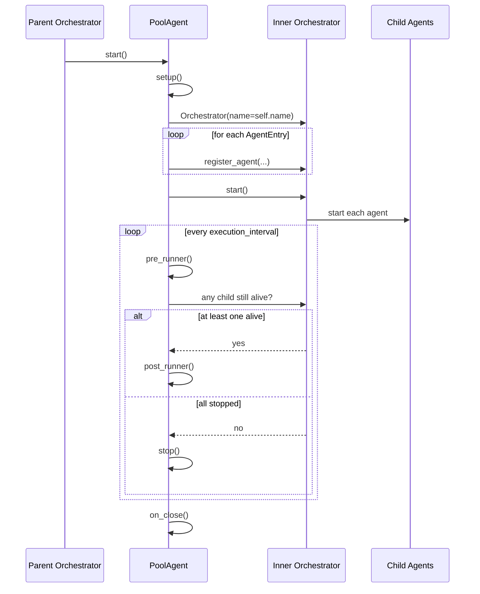

# PoolAgent

The **PoolAgent** is a `PeriodicAgent` that owns an `Orchestrator` of its own. Instead of running your logic directly, it starts a group of child agents and then supervises them: at every interval it checks whether any of them is still alive, and stops itself once they have all finished.

In other words, a PoolAgent is the point where the agent hierarchy becomes a **tree** rather than a flat list: the top-level orchestrator sees one agent, and that agent internally manages several more.

## Why use PoolAgent?

Use it when a unit of work is naturally a *group* rather than a single task:

- **Fan-out inside one process.** A `PoolProcessAgent` runs in its own process and hosts several thread agents inside it. Those threads share memory, so they can pass large objects through a plain `Queue` without paying the serialisation cost of crossing a process boundary.
- **Lifecycle grouping.** Children start when the pool starts and the pool shuts down when they are all done — you get a single handle for the whole group.
- **Replication.** Registering the same PoolAgent class three times gives you three independent copies of the same internal topology.

<Tip>
If you only need N copies of *one* agent, register that agent N times on the top-level orchestrator. Reach for a PoolAgent when the children differ from each other, or when they need to share process-local state.
</Tip>

## Usage

You create a custom pool by inheriting from `PoolProcessAgent` or `PoolThreadAgent` and declaring the children in `Config.agents_entry`.

| Method | Description | Override |
|--------|-------------|----------|
| [setup](#setup) | Register and start the child agents. | Optional :orange_circle: |
| [pre_runner](#pre-runner) | Run custom logic before each supervision check. | Optional :orange_circle: |
| [post_runner](#post-runner) | Run custom logic after each supervision check. | Optional :orange_circle: |
| [on_close](#on-close) | Clean up once every child has stopped. | Optional :orange_circle: |

<Warning title="runner is final">
Unlike every other agent in the framework, you do **not** implement `runner` here. It is marked `@final` because it holds the supervision logic that defines what a pool is. Use `pre_runner` and `post_runner` for your own periodic work.
</Warning>

<Tip title="Important">
Make sure to call the parent method **for each overridden** method.

```python{3}
class MyPool(PoolProcessAgent):
    def setup(self):
        super().setup()
        # Custom setup logic
```

Overriding `setup` without calling `super().setup()` means the children are never registered and never started.
</Tip>

## Inheritance



To learn more about `PeriodicAgent` click [here](/learn/agents/built-in-agents/periodicagent).

## Sequence Diagram

The diagram below shows what happens after a PoolAgent is started. Note the second orchestrator: the one the pool creates for itself.



## Configuration

`PoolAgent` extends the `PeriodicAgent` configuration with the fields that describe the group.

| Attribute | Default | Description |
|-----------|---------|-------------|
| agents_entry | `None` | The list of `AgentEntry` objects describing the child agents to register. |
| auto_reboot | `False` | Flag reserved for automatic restart of stopped children. |
| orchestrator_config | `None` | Configuration of the inner orchestrator. When omitted, the pool builds one with the command interface disabled. |
| execution_interval | 1.0 | How often the pool checks on its children, in seconds. |

<Warning>
If `agents_entry` is left empty the pool validates with a warning, logs `No agents for current pool agent.` and does nothing useful — it has no children to supervise, so it just idles. Treat that warning as an error in your own setup.
</Warning>

<Info>
`auto_reboot` is accepted, validated and logged, but the supervision loop does not act on it yet: a child that dies is not restarted. Do not rely on it to keep children alive.
</Info>

Each child is described by an `AgentEntry`, which carries the agent class, its name, its configuration and any extra keyword arguments to forward to the constructor. For the exact signature see the [API reference](/api/orchestrator).

<Warning title="The inner orchestrator must not take the parent's command port">
The default `command_zmq_address` is `tcp://127.0.0.1:5555` for every orchestrator, and the top-level one has already bound it. A pool that enabled the command interface on that address would die on startup with `Address already in use`. That is why the inner orchestrator runs without a command interface unless you provide an `orchestrator_config` of your own — and if you do, give it an address nobody else uses:

```python
class Collector(PoolProcessAgent):
    class Config(PoolProcessAgent.Config):
        agents_entry = [AgentEntry(Producer, "Producer")]
        orchestrator_config = Orchestrator.Config(
            command_zmq_address="tcp://127.0.0.1:5556"
        )
```
</Warning>

To learn more about the configuration object, click [here](/learn/agents/index#configuration).

## Methods

### setup

```python
@template
```

Creates the inner `Orchestrator` from `config.orchestrator_config`, registers every entry in `config.agents_entry` and starts it. Override it to add your own initialisation, always calling `super().setup()` first.

### runner

```python
@final
```

The supervision step. It calls `pre_runner`, reclaims the worker slots of children that have finished — which is what starts the next child waiting in the queue — checks whether every child has stopped, and if so stops the pool; otherwise it calls `post_runner`.

<Warning title="Do not override">
Marked as `@final`. Implement [pre_runner](#pre-runner) or [post_runner](#post-runner) instead.
</Warning>

<Note>
Reclaiming those slots is the pool's job because nothing else does it: the inner orchestrator's `join()` is never called, and that loop is what normally drains the worker queue. A pool with more children than the inner `max_workers` (`5` by default) depends on this to start the ones beyond the limit.
</Note>

### pre_runner

```python
@template
```

Called at the beginning of every supervision cycle, before the liveness check.

### post_runner

```python
@template
```

Called at the end of every supervision cycle, but **only while at least one child is still running**. When the last child stops, the pool stops instead and this method is skipped for that final cycle — so it is not the right place for teardown logic. Use [on_close](#on-close) for that.

### on_close

```python
@optional
```

Shuts the inner orchestrator down: the children are stopped and joined, then the inner message router, plugins, event bus and message channel are released. Without it the children outlive the pool — for a `PoolThreadAgent` they are non-daemon threads in the same process, so they outlive the whole application.

<Warning>
When overriding, call `super().on_close()`, or the pool's children are left running.
</Warning>

## Attributes

### Orchestrator

```python
orchestrator: Orchestrator
```

The inner orchestrator that owns the child agents. Accessing it before `setup()` has run raises `RuntimeError`.

For the full list of inherited methods and attributes, see the [API reference](/api/agent).

## Example

A `PoolProcessAgent` that hosts a thread agent producing large payloads. The queue is shared in-process, so the payload never crosses a process boundary.

```python
from multiprocessing import Queue

from PyOrchestrate.core.agent import PeriodicThreadAgent
from PyOrchestrate.core.agent.pool_agent import PoolProcessAgent
from PyOrchestrate.core.orchestrator import Orchestrator
from PyOrchestrate.core.orchestrator.memory import AgentEntry


class Producer(PeriodicThreadAgent):
    """Thread agent that writes payloads into a shared queue."""

    class Config(PeriodicThreadAgent.Config):
        execution_interval = 0.1
        limit = 5

    config: Config

    def runner(self):
        self.logger.info(f"Thread {self.name} writing to queue.")
        self.queue.put("a" * 1_000_000)


class Collector(PoolProcessAgent):
    """Process agent that supervises a group of Producer threads."""

    class Config(PoolProcessAgent.Config):
        queue = Queue()
        execution_interval = 1
        agents_entry: list[AgentEntry] = [
            AgentEntry(Producer, "Producer", queue=queue),
        ]

    config: Config

    def on_close(self):
        # Stops the children first: without it they keep running
        super().on_close()

        while not self.config.queue.empty():
            self.config.queue.get()
            self.logger.info("Draining the queue")


if __name__ == "__main__":
    orchestrator = Orchestrator(config=Orchestrator.Config(max_workers=2))

    orchestrator.register_agent(Collector, "Collector1")
    orchestrator.register_agent(Collector, "Collector2")
    orchestrator.start()
    orchestrator.join()
```

A runnable version of this example lives in `examples/example_pool_agent.py`.

<Warning title="Children of a process pool must be threads">
The children of a `PoolProcessAgent` are started inside the pool's own process. Nesting process agents inside a process pool means nesting `multiprocessing` inside `multiprocessing`, which is fragile across platforms — on macOS and Windows the default `spawn` start method has to re-import and re-pickle everything. Keep the children as thread agents.
</Warning>
