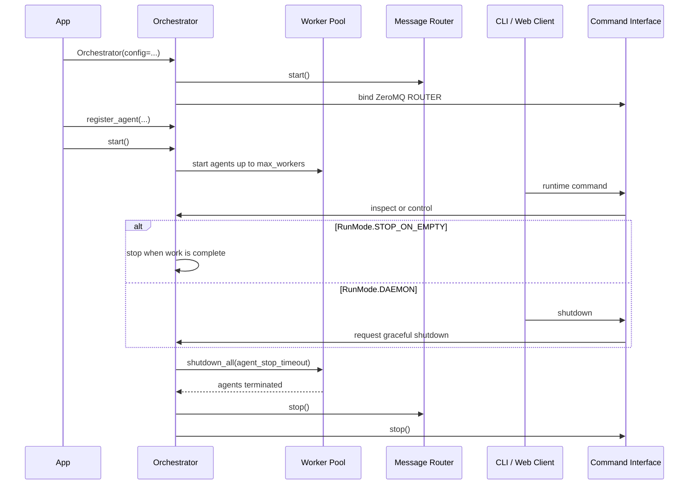

# Orchestrator

`Orchestrator` is the built-in coordinator for agent registration, dependency validation, worker scheduling, event history, inter-agent message routing, and external runtime commands.

There is no public `BaseOrchestrator` class in the current package. Customize behavior by configuring or subclassing `Orchestrator`.

## Lifecycle



Agents are always stopped and joined before the router, the command interface,
and the plugins are shut down. A process agent that ignores the cooperative
stop request is force-terminated once `agent_stop_timeout` expires; a thread
agent that ignores it cannot be, so it is quarantined and reported.

## Configuration

| Attribute | Default | Description |
|---|---|---|
| `check_interval` | `1` | Agent status polling interval in seconds |
| `max_workers` | `5` | Maximum number of concurrently running agents |
| `agent_start_timeout` | `30.0` | Timeout for the `start_event` acknowledgement, for supplied and default state events alike |
| `agent_stop_timeout` | `10.0` | Budget shared by all agents while shutdown waits for them to terminate |
| `enable_command_interface` | `True` | Enable external runtime commands |
| `command_zmq_address` | `"tcp://*:5555"` | ZeroMQ ROUTER bind address |
| `allowed_commands` | `None` | Preset, explicit set, or all commands |
| `run_mode` | `RunMode.STOP_ON_EMPTY` | Orchestrator lifecycle policy |
| `history_max_events` | `5000` | Event history capacity |
| `history_payload_bytes` | `256` | Maximum stored event payload size |

```python
from PyOrchestrate.core.orchestrator import Orchestrator, RunMode

config = Orchestrator.Config(
    max_workers=2,
    command_zmq_address="tcp://127.0.0.1:5555",
    run_mode=RunMode.DAEMON,
)

orchestrator = Orchestrator(
    config=config,
    name="MyOrchestrator",
)
```

See [Config and Validation](/learn/config_and_validation) for the shared configuration model.

## Main Components

### Agent Memory

`OMemory` stores registered agent entries and groups.

### Dependency Graph

`DependencyGraph` validates agent dependencies and determines which agents can start.

### Worker Pool

`WorkerPoolScheduler` enforces `max_workers` and queues agents when no execution slot is available.

### Event Bus and Store

`OrchestratorEventBus` combines event dispatch with bounded event history. Every event emitted through it reaches both the registered callbacks and `EventStore`.

### Message Router

`MessageRouter` consumes agent messages and forwards lifecycle information to the event bus, which dispatches the callbacks and records the event in history.

### Command Interface

When enabled, `CommandInterface` binds a ZeroMQ ROUTER socket and serves CLI or web monitoring clients.

## Register and Run Agents

```python
orchestrator.register_agent(Worker, "Worker1")
orchestrator.register_agent(Worker, "Worker2")

orchestrator.start()
orchestrator.join()
```

For a continuously available orchestrator, use `RunMode.DAEMON` and request shutdown through the CLI:

```bash
pyorchestrate shutdown
```

## Subclassing

Subclass `Orchestrator` when configuration alone is insufficient:

```python
from PyOrchestrate.core.orchestrator import Orchestrator


class MyOrchestrator(Orchestrator):
    class Config(Orchestrator.Config):
        max_workers = 2
```

Prefer passing an `Orchestrator.Config` instance when only values need to change.
